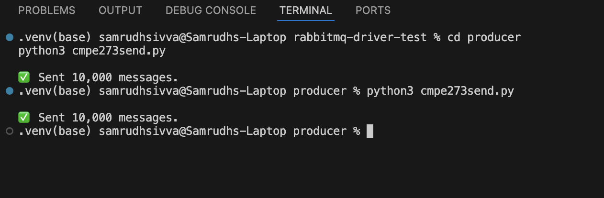
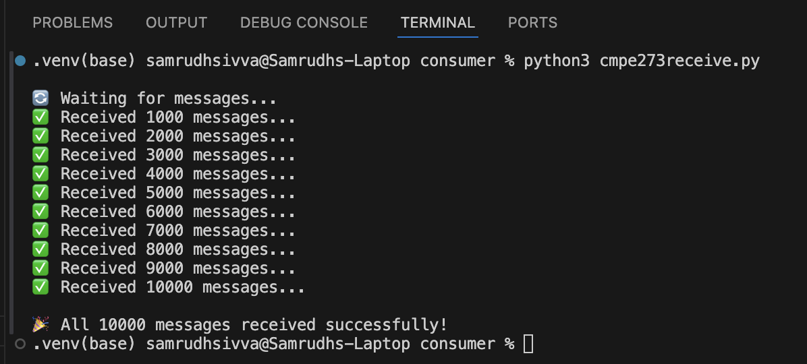
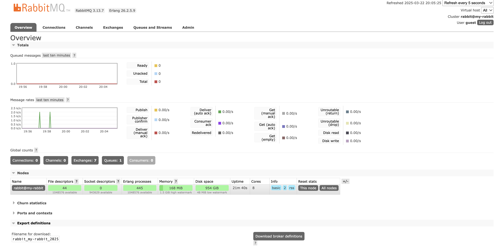

✅ Clean and Proper README.md

# 📨 RabbitMQ Driver Verification - CMPE 273 Assignment

🚀 How to Run

1️⃣ Start the Consumer (in one terminal):
cd consumer
python3 cmpe273receive.py
2️⃣ Start the Producer (in another terminal):
cd producer
python3 cmpe273send.py
✅ Expected Output

🖥️ Consumer Terminal
✅ Received 1000 messages...
✅ Received 2000 messages...
...
🎉 All 10000 messages received successfully!
🖥️ Producer Terminal
✅ Sent 10,000 messages.
## 📸 Screenshots

### ✅ Messages Sent from Producer

### 📥 Messages Received by Consumer

### 📊 RabbitMQ Queue Dashboard

📊 Test Results

Metric	Count
Messages Sent	10,000
Messages Received	10,000
Messages Lost	0
Message Loss Rate	0.00%
✅ Message queue is working reliably with RabbitMQ and pika.
